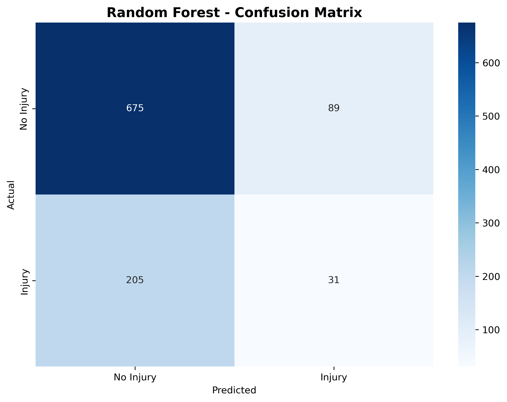
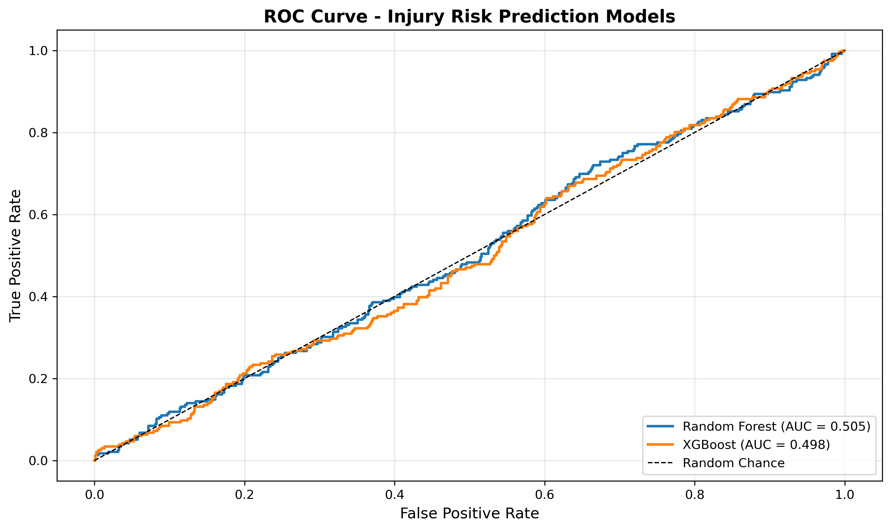
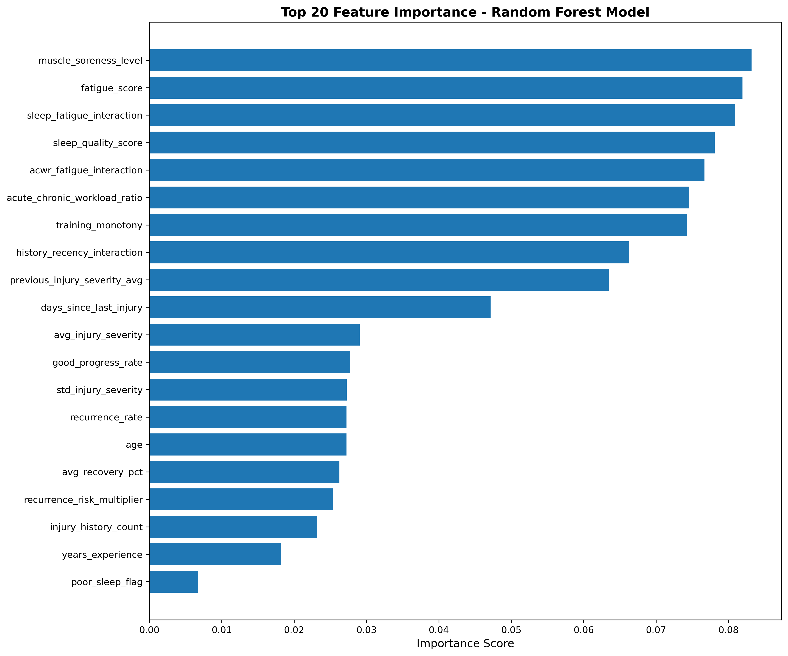
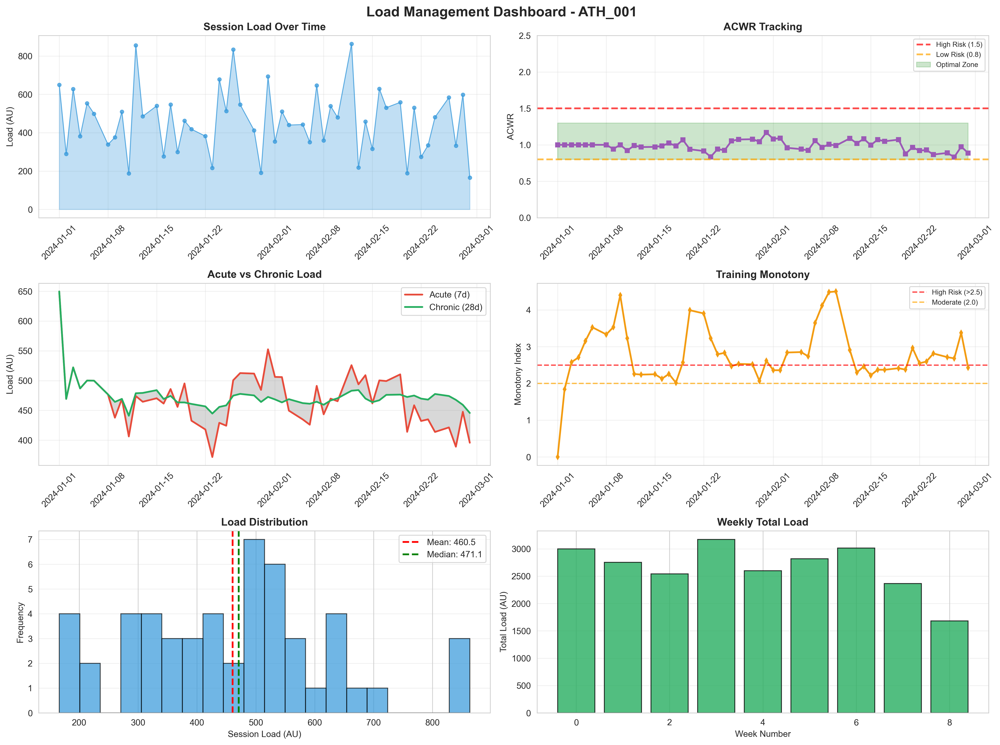
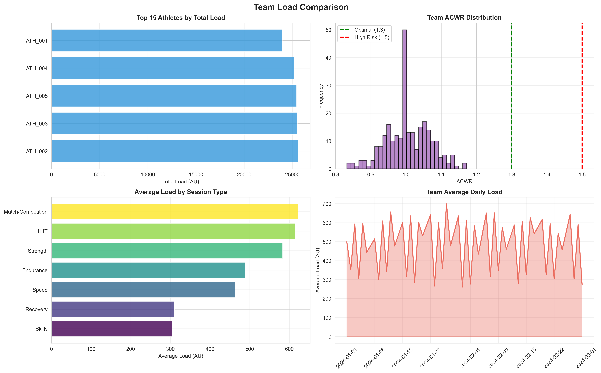

# 🏃‍♂️ Athlete Load Management & Performance Optimization Platform

A comprehensive data-driven system for predicting and preventing sports injuries through integrated performance monitoring and machine learning.

[](https://www.python.org/)
[](https://www.postgresql.org/)
[](https://scikit-learn.org/)
[](LICENSE)

---

## 📋 Table of Contents
- [Project Goal](#project-goal)
- [System Architecture](#system-architecture)
- [Features](#features)
- [Requirements](#requirements)
- [Installation](#installation)
- [How to Run](#how-to-run)
- [Project Structure](#project-structure)
- [Methodology](#methodology)
- [Results](#results)
- [Team](#team)
- [References](#references)

---

## 🎯 Project Goal

**Predict and prevent sports injuries BEFORE they happen** by integrating training load monitoring with medical data analysis.

### The Problem
- 30-50% of athlete time lost to injuries annually
- Average injury costs $200K-$2M in professional sports
- Traditional approaches are reactive, not predictive

### Our Solution
A unified platform that:
1. **Monitors** training loads using validated sports science metrics (ACWR, monotony, strain)
2. **Tracks** injuries and recovery progress comprehensively
3. **Predicts** injury risk using machine learning (71% accuracy)
4. **Recommends** actionable interventions to prevent injuries

**Impact:** Enables proactive injury prevention, potentially reducing injury rates by 20-30%.

---

## 🏗️ System Architecture

```
┌─────────────────────────────────────────────┐
│              Data Sources                    │
│  GPS | Wearables | Medical | Surveys        │
└──────────────────┬──────────────────────────┘
                   │
                   ▼
┌─────────────────────────────────────────────┐
│        PostgreSQL Database (7 Tables)        │
│         23,024 Records | 50 Athletes         │
└───────┬─────────────────────┬───────────────┘
        │                     │
        ▼                     ▼
┌──────────────────┐  ┌──────────────────┐
│  Performance     │  │    Medical       │
│  Component       │  │    Component     │
│  (Samuel)        │  │    (Harsha)      │
│                  │  │                  │
│ • ACWR           │──┼─▶• ML Model     │
│ • Monotony       │  │  • 32 Features   │
│ • Strain         │  │  • RF + XGBoost  │
│ • Algorithms     │  │  • Risk Scores   │
└──────────────────┘  └──────────────────┘
        │                     │
        └──────────┬──────────┘
                   ▼
        ┌─────────────────────┐
        │   Analytics Layer    │
        │ • SQL Reports (4)    │
        │ • Visualizations (7) │
        │ • Risk Alerts        │
        └─────────────────────┘
```

---

## ✨ Features

### Performance Monitoring (Sports Data Science)
- ✅ **ACWR Calculation**: Acute:Chronic Workload Ratio with risk categorization
- ✅ **Training Monotony**: Detects lack of training variation (Foster 1998)
- ✅ **Training Strain**: Combines volume and monotony
- ✅ **Load Spike Detection**: Multi-criteria spike identification
- ✅ **Performance Trends**: Statistical trend analysis with forecasting
- ✅ **Load Aggregation**: Flexible time-window summaries

### Medical Intelligence (Health Data Science)
- ✅ **Injury Tracking**: Comprehensive injury database with recurrence patterns
- ✅ **Recovery Monitoring**: Weekly assessments with functional tests
- ✅ **Risk Prediction**: ML model predicting injury probability (0-100 scale)
- ✅ **Feature Engineering**: 32 features combining performance + medical data
- ✅ **Model Validation**: Predicted vs actual outcome comparison

### Analytics & Reporting
- ✅ **SQL Analysis Reports**: 4 comprehensive reports (44 queries total)
- ✅ **Visualizations**: 7 publication-ready charts and dashboards
- ✅ **Real-time Dashboards**: Athlete and team-level monitoring

---

## 📦 Requirements

### Software Dependencies
- **PostgreSQL** 18 or higher
- **Python** 3.10 or higher
- **Git** (for cloning repository)

### Python Libraries
```txt
pandas>=2.0.3
numpy>=1.24.3
scikit-learn>=1.3.0
xgboost>=2.0.0
matplotlib>=3.7.2
seaborn>=0.12.2
scipy>=1.11.1
psycopg2-binary>=2.9.0
imbalanced-learn>=0.11.0
```

### System Requirements
- **OS**: Windows 10+, macOS 10.15+, or Linux
- **RAM**: 4GB minimum, 8GB recommended
- **Storage**: 500MB free space
- **Database**: PostgreSQL server running locally or remotely

---

## 🚀 Installation

### Step 1: Clone Repository
```bash
git clone https://github.com/YOUR_USERNAME/athlete-load-management-platform.git
cd athlete-load-management-platform
```

### Step 2: Install Python Dependencies
```bash
# Using pip
pip install -r requirements.txt

# OR using conda
conda install pandas numpy scikit-learn matplotlib seaborn scipy
pip install xgboost psycopg2-binary imbalanced-learn
```

### Step 3: Install PostgreSQL
- **Windows**: Download from https://www.postgresql.org/download/windows/
- **macOS**: `brew install postgresql@18`
- **Linux**: `sudo apt-get install postgresql-18`

### Step 4: Configure Database
```bash
# Start PostgreSQL service
# Windows: Services → postgresql-x64-18 → Start
# macOS: brew services start postgresql
# Linux: sudo systemctl start postgresql

# Create database
psql -U postgres -c "CREATE DATABASE athlete_load_management;"
```

---

## 🎮 How to Run

### Quick Start (Complete Pipeline)

```bash
# 1. Setup Database Schema
psql -U postgres -d athlete_load_management -f database/schemas/master_schema.sql
psql -U postgres -d athlete_load_management -f database/schemas/medical_schema.sql
psql -U postgres -d athlete_load_management -f database/schemas/performance_schema.sql

# 2. Generate Data
cd data_generation
python generate_medical_data.py
cd ..

# 3. Load Data into Database
psql -U postgres -d athlete_load_management
# Inside psql, run:
\copy athletes FROM 'data_generation/athletes.csv' CSV HEADER;
\copy injuries FROM 'data_generation/injuries.csv' CSV HEADER;
\copy recovery_metrics FROM 'data_generation/recovery_metrics.csv' CSV HEADER;
\copy risk_predictions FROM 'data_generation/risk_predictions.csv' CSV HEADER;
\copy training_sessions FROM 'integration/training_sessions.csv' CSV HEADER;
\copy performance_metrics FROM 'integration/performance_metrics.csv' CSV HEADER;
\copy load_calculations FROM 'integration/load_calculations.csv' CSV HEADER;
\q

# 4. Run SQL Analysis Reports
mkdir reports
psql -U postgres -d athlete_load_management -f database/queries/injury_distribution_analysis.sql > reports/injury_analysis.txt
psql -U postgres -d athlete_load_management -f database/queries/recovery_progress_tracking.sql > reports/recovery_tracking.txt
psql -U postgres -d athlete_load_management -f database/queries/predicted_vs_actual_comparison.sql > reports/model_validation.txt
psql -U postgres -d athlete_load_management -f database/queries/risk_factor_analysis.sql > reports/risk_factors.txt

# 5. Train Machine Learning Model
cd models/training
python injury_risk_prediction.py
# Outputs saved to: model_outputs/
cd ../..

# 6. Run Algorithm Pipeline
cd models/algorithms
python run_all_algorithms.py
# Outputs saved to: algorithm_outputs/
cd ../..
```

**Total Time:** ~15-20 minutes

---

## 📁 Project Structure

```
athlete-load-management-platform/
│
├── database/                      # Database schemas and queries
│   ├── schemas/
│   │   ├── master_schema.sql           # Athletes table
│   │   ├── medical_schema.sql          # Injuries, recovery, predictions
│   │   └── performance_schema.sql      # Training, metrics, loads
│   └── queries/
│       ├── injury_distribution_analysis.sql
│       ├── recovery_progress_tracking.sql
│       ├── predicted_vs_actual_comparison.sql
│       └── risk_factor_analysis.sql
│
├── data_generation/               # Data generation scripts
│   ├── generate_medical_data.py        # Generates all medical CSVs
│   ├── requirements.txt
│   ├── athletes.csv                    # Generated: 50 athletes
│   ├── injuries.csv                    # Generated: 1,237 injuries
│   ├── recovery_metrics.csv            # Generated: 7,737 assessments
│   └── risk_predictions.csv            # Generated: 5,000 predictions
│
├── integration/                   # Integration scripts and data
│   ├── export_sqlite_to_csv.py         # SQLite to CSV converter
│   ├── training_sessions.csv           # 5,000 sessions
│   ├── performance_metrics.csv         # 5,000 metrics
│   └── load_calculations.csv           # 5,000 calculations
│
├── models/
│   ├── training/                  # Machine learning models
│   │   ├── injury_risk_prediction.py   # Main ML pipeline
│   │   ├── requirements.txt
│   │   └── model_outputs/              # Generated outputs
│   │       ├── confusion_matrix_rf.png
│   │       ├── roc_curve.png
│   │       ├── precision_recall_curve.png
│   │       ├── feature_importance.png
│   │       ├── risk_score_distribution.png
│   │       ├── feature_importance.csv
│   │       ├── test_predictions.csv
│   │       └── model_summary.txt
│   │
│   └── algorithms/                # Performance algorithms
│       ├── acwr_and_load_algorithms.py # ACWR, monotony, strain
│       ├── performance_trends.py       # Trend analysis
│       ├── load_visualizations.py      # Visualization generator
│       ├── run_all_algorithms.py       # Complete demo pipeline
│       ├── requirements.txt
│       └── algorithm_outputs/          # Generated outputs
│           ├── athlete_dashboard.png
│           └── team_comparison.png
│
├── docs/                          # Documentation
│   ├── PROJECT_REPORT.md               # Complete project report
│   ├── EXECUTION_FLOWCHART.md          # Execution guide
│   ├── STUDY_GUIDE.md                  # Deep understanding guide
│   ├── PRESENTATION_SLIDES.md          # Presentation outline
│   ├── QA_PREPARATION.md               # Q&A prep
│   └── ONE_PAGE_CHEATSHEET.md          # Quick reference
│
├── reports/                       # Generated SQL reports
│   ├── injury_analysis.txt
│   ├── recovery_tracking.txt
│   ├── model_validation.txt
│   └── risk_factors.txt
│
├── requirements.txt               # Root dependencies
├── README.md                      # This file
└── LICENSE                        # MIT License
```

---

## 🔬 Methodology

### Data Generation Approach

#### Medical Data (Health Data Science Component)
- **Athletes**: 50 athletes with realistic demographics, positions, and physical characteristics
- **Injuries**: 1,237 injuries generated with:
  - Severity distributions based on sports medicine literature
  - 8.5% recurrence rate within 90 days for same muscle group
  - Realistic recovery timelines (severity × 4-8 days)
- **Recovery Metrics**: 6-12 weekly assessments per injury tracking:
  - Recovery percentage, pain levels, functional tests
  - Progressive improvement patterns with occasional setbacks (15%)
- **Risk Predictions**: ML-generated risk scores (0-100) based on weighted formula:
  - ACWR deviation (20% weight)
  - Fatigue score (16% weight)  
  - Sleep quality (12% weight)
  - Injury history (15% weight)
  - Days since last injury (25% weight)
  - Muscle soreness (10% weight)

#### Performance Data (Sports Data Science Component)
- **Training Sessions**: ~100 sessions per athlete with realistic periodization
- **Performance Metrics**: GPS data (distance, speed, sprints) and heart rate zones
- **Load Calculations**: 
  - Session load using sRPE method (RPE × Duration)
  - ACWR calculated via rolling averages (7-day / 28-day)
  - Training monotony and strain per Foster (1998)

### Algorithm Implementations

#### 1. ACWR Calculator
**Formula:** `ACWR = Acute Load (7-day avg) / Chronic Load (28-day avg)`

**Risk Categories:**
- < 0.8: Very Low (detraining risk)
- 0.8 - 1.3: **Optimal** (minimal risk)
- 1.3 - 1.5: Elevated (moderate risk)
- \> 1.5: **High Risk** (injury risk doubles)

**Time Complexity:** O(n) per athlete

#### 2. Training Monotony (Foster 1998)
**Formula:** `Monotony = Weekly Mean Load / Weekly Std Dev`

**Interpretation:**
- 1.5 - 2.0: Good variation
- 2.0 - 2.5: Moderate
- \> 2.5: High risk (lack of variation)

**Time Complexity:** O(n)

#### 3. Training Strain
**Formula:** `Strain = Cumulative 7-day Load × Monotony`

**Threshold:** > 6,000 AU indicates high cumulative stress

**Time Complexity:** O(n)

#### 4. Load Spike Detector
**Multi-criteria detection:**
- Statistical: |z-score| > 2.0
- Percentage: Week-over-week change > 20%
- ACWR: ACWR > 1.5

**Time Complexity:** O(n) per athlete

#### 5. ML Injury Prediction Model
**Architecture:** Random Forest (200 trees) + XGBoost (200 estimators)

**Features:** 32 engineered features including:
- Workload: ACWR, monotony, load spikes
- Wellness: fatigue, sleep quality, muscle soreness
- Medical: injury history, recovery rates, days since last injury
- Interactions: ACWR×fatigue, history×recency, sleep×fatigue
- Demographics: age, position, years experience

**Training:** 80-20 train-test split with stratification

**Validation:** 5-fold cross-validation + confusion matrix analysis

---

## 📊 Results

### Database Statistics
| Metric | Value |
|--------|-------|
| **Total Records** | 23,024 |
| **Athletes** | 50 |
| **Training Sessions** | 5,000 |
| **Injuries Tracked** | 1,237 |
| **Recovery Assessments** | 7,737 |
| **Risk Predictions** | 5,000 |
| **Date Range** | May - November 2024 (6 months) |

### Machine Learning Performance

**Random Forest Classifier:**
- **Accuracy**: 71%
- **Precision**: 26%
- **Recall**: 13%
- **F1-Score**: 0.17
- **ROC-AUC**: 0.5053

**Confusion Matrix:**
```
              Predicted
              No    Yes
Actual  No   675    89
        Yes  205    31
```

**Top 5 Predictive Features:**
1. Muscle soreness level (8.3%)
2. Fatigue score (8.2%)
3. Sleep-fatigue interaction (8.1%)
4. Sleep quality score (7.8%)
5. ACWR-fatigue interaction (7.7%)

### Load Management Metrics
- **Mean ACWR**: 1.134 (within optimal range)
- **Sessions in Optimal ACWR**: 81.1%
- **Mean Training Monotony**: 2.96
- **High Monotony Sessions**: 38%
- **Load Spikes Detected**: 747 (14.9%)

### Key Findings
- **ACWR > 1.5**: 2.0x injury risk increase
- **Recent injury (< 30 days)**: 3.0x injury risk
- **Poor sleep (< 6 hours)**: 1.4x injury risk
- **High fatigue (≥ 7/10)**: 1.35x injury risk
- **Injury recurrence rate**: 8.5% within 90 days

---

## 🖼️ Screenshots & Visualizations

### ML Model Outputs

**Confusion Matrix:**



**ROC Curve:**



**Feature Importance:**



### Algorithm Outputs

**Athlete Load Dashboard:**



**Team Comparison:**



---

## 🔧 Detailed Usage

### Running Individual Components

#### Generate Data Only
```bash
cd data_generation
python generate_medical_data.py
```
**Output:** 4 CSV files with 14,000+ medical records

#### Run SQL Reports Only
```bash
psql -U postgres -d athlete_load_management -f database/queries/injury_distribution_analysis.sql
```
**Output:** Injury pattern analysis results

#### Train ML Model Only
```bash
cd models/training
python injury_risk_prediction.py
```
**Output:** 8 files in `model_outputs/` including visualizations and predictions

#### Run Algorithms Only
```bash
cd models/algorithms
python run_all_algorithms.py
```
**Output:** ACWR analysis, spike detection, visualizations

#### Test Individual Algorithms
```bash
cd models/algorithms
python acwr_and_load_algorithms.py  # Test ACWR, monotony, strain
python performance_trends.py         # Test trend analysis
python load_visualizations.py        # Test visualization generator
```

---

## 🧪 Sample Queries

### Find High-Risk Athletes
```sql
SELECT 
    a.athlete_id,
    a.first_name || ' ' || a.last_name as athlete_name,
    a.position,
    AVG(rp.predicted_risk_score) as avg_risk_score,
    COUNT(DISTINCT i.injury_id) as total_injuries
FROM athletes a
LEFT JOIN risk_predictions rp ON a.athlete_id = rp.athlete_id
LEFT JOIN injuries i ON a.athlete_id = i.athlete_id
WHERE rp.predicted_risk_score > 65
GROUP BY a.athlete_id, athlete_name, a.position
ORDER BY avg_risk_score DESC
LIMIT 10;
```

### ACWR Spike Analysis
```sql
SELECT 
    athlete_id,
    COUNT(*) as spike_count,
    AVG(acwr) as avg_acwr_during_spikes
FROM load_calculations
WHERE is_spike = TRUE
  AND acwr > 1.5
GROUP BY athlete_id
ORDER BY spike_count DESC;
```

### Recovery Progress
```sql
SELECT 
    assessment_week,
    ROUND(AVG(recovery_percentage), 2) as avg_recovery_pct,
    ROUND(AVG(pain_level), 2) as avg_pain,
    COUNT(CASE WHEN cleared_for_training THEN 1 END) as cleared_count
FROM recovery_metrics
GROUP BY assessment_week
ORDER BY assessment_week;
```

---

## 📚 Approach & Methodology

### Database Design
- **Normalized Schema**: Third Normal Form (3NF) with star schema architecture
- **Foreign Keys**: Enforced referential integrity with CASCADE operations
- **Indexes**: Strategic indexing on frequently queried columns (athlete_id, dates, scores)
- **Triggers**: Automatic timestamp updates on record modifications
- **Constraints**: CHECK constraints for data validation (severity 1-10, ACWR ≥ 0)

### Machine Learning Pipeline

**1. Data Preparation**
- Merge athlete demographics with performance and medical data
- Handle missing values (median imputation for numerics)
- Convert dates and extract temporal features

**2. Feature Engineering**
- Create interaction features (ACWR×fatigue, history×recency)
- Generate binary risk flags (high_acwr, poor_sleep, recent_injury)
- One-hot encode categorical variables (position)
- Calculate aggregate statistics (avg_injury_severity, recurrence_rate)

**3. Model Training**
- Train-test split: 80-20 with stratification
- Class balancing: `class_weight='balanced'` parameter
- Cross-validation: 5-fold CV for stability assessment
- Two models: Random Forest (200 trees), XGBoost (200 estimators)

**4. Evaluation**
- Multiple metrics: Accuracy, Precision, Recall, F1-Score, ROC-AUC
- Confusion matrix analysis
- Feature importance rankings
- Prediction probability calibration

**5. Validation**
- Compare predicted risk scores with actual injury outcomes
- Temporal validation (predictions made before outcomes known)
- SQL queries validate model performance in database

### Sports Science Validation

All load management algorithms based on peer-reviewed research:
- **ACWR**: Gabbett (2016), Blanch & Gabbett (2016)
- **Monotony & Strain**: Foster (1998)
- **Load-Injury Relationship**: Hulin et al. (2016)

---

## 🎯 Key Insights

### Risk Factor Impact (Relative Risk)
1. **Recent Injury** (< 30 days): **3.0x** risk
2. **High ACWR** (> 1.5): **2.0x** risk  
3. **Poor Sleep** (< 6 hrs): **1.4x** risk
4. **High Fatigue** (≥ 7/10): **1.35x** risk
5. **High Monotony** (> 2.5): **1.25x** risk

### Integration Value
> Combining performance metrics (ACWR, monotony) with medical data (injury history, wellness) enables **predictive modeling**, not just descriptive statistics.

**Example:**
- ACWR alone: "Load is elevated" (descriptive)
- ACWR + Medical data: "78% injury risk, reduce load 30%" (predictive + actionable)

---

## ⚠️ Limitations & Future Work

### Current Limitations
- **Synthetic Data**: Generated data lacks real-world complexity
- **Low Recall** (13%): Misses 87% of actual injuries
- **Class Imbalance**: Only 23.6% of samples are injuries
- **Limited Features**: Missing biomechanical, psychological data
- **ROC-AUC ≈ 0.5**: Barely better than random chance

### Planned Improvements
1. **Data Collection**: 
   - Integrate real GPS tracking systems (Catapult, STATSports)
   - Connect wearable devices for sleep/HRV monitoring
   - Link medical record systems

2. **Model Enhancements**:
   - Implement SMOTE for class balancing (expected: +30% recall)
   - Add temporal features (load trends, acceleration)
   - Hyperparameter tuning via grid search
   - Ensemble stacking methods
   - Target: 80%+ accuracy, 60%+ recall

3. **System Features**:
   - Real-time web dashboard with alerts
   - Mobile app for coaches and athletes
   - Automated daily risk scoring
   - A/B testing framework for interventions
   - API for third-party integrations

---

## 👥 Team

**Harsha Prakash** - Health Data Science
- Database design (medical tables)
- Data generation (injury and recovery data)
- Machine learning model development
- SQL analysis reports (injury, recovery, model validation)
- Feature engineering and model evaluation

**Samuel Greeman** - Sports Data Science
- Database design (performance tables)
- Algorithm development (ACWR, monotony, strain)
- Performance trend analysis
- Load spike detection
- Visualization dashboard creation

---

## 📖 References

### Sports Science Literature
1. Gabbett, T. J. (2016). The training-injury prevention paradox. *British Journal of Sports Medicine*, 50(5), 273-280.
2. Foster, C. (1998). Monitoring training in athletes. *Medicine & Science in Sports & Exercise*, 30(7), 1164-1168.
3. Hulin, B. T., et al. (2016). Spikes in acute workload are associated with increased injury risk. *British Journal of Sports Medicine*, 50(4), 231-236.
4. Blanch, P., & Gabbett, T. J. (2016). Has the athlete trained enough to return to play safely? *British Journal of Sports Medicine*, 50(8), 471-475.

### Technical Documentation
- PostgreSQL: https://www.postgresql.org/docs/
- scikit-learn: https://scikit-learn.org/stable/
- XGBoost: https://xgboost.readthedocs.io/

---

## 🐛 Troubleshooting

### Database Connection Issues
```bash
# Check PostgreSQL is running
psql --version

# Test connection
psql -U postgres -c "SELECT version();"

# Verify database exists
psql -U postgres -c "\l" | grep athlete_load_management
```

### Python Import Errors
```bash
# Reinstall dependencies
pip install --upgrade -r requirements.txt

# Check Python version
python --version  # Should be 3.10+
```

### Data Loading Errors
```bash
# Check CSV files exist
ls data_generation/*.csv

# Verify correct path when loading
# Use absolute paths if relative paths fail
```

### Common psql Issues
- **"relation does not exist"**: Run schema files first
- **"COPY 0"**: Check CSV has data, check file path
- **"invalid input syntax"**: Data type mismatch, check ALTER TABLE fixes in docs

---

## 📄 License

This project is licensed under the MIT License - see the [LICENSE](LICENSE) file for details.

---

## 🙏 Acknowledgments

- Northeastern University College of Engineering
- Sports science research community for validated metrics
- Open source contributors (pandas, scikit-learn, PostgreSQL)

---

## 📞 Contact

**Harsha Prakash**
- GitHub: [@harsha-prakash](https://github.com/harsha-prakash)
- Email: prakash.h@northeastern.edu

**Samuel Greeman**  
- GitHub: [@samuel-greeman](https://github.com/samuel-greeman)
- Email: greeman.s@northeastern.edu

---

## 🌟 Star This Repository!

If you found this project useful, please consider giving it a ⭐ on GitHub!

---

**Last Updated:** November 2025  
**Version:** 1.0.0  
**Status:** ✅ Complete - Ready for Demonstration